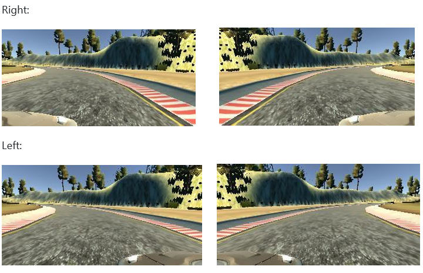

# CarND-BehavioralCloning-P3
Udacity CarND Behavioral Cloning Project https://www.udacity.com/drive

## Files Submitted & Code Quality 

**1. Submission includes all required files and can be used to run the simulator in autonomous mode**   

My project includes the following files:  
• model.py containing the script to create and train the model  
• drive.py for driving the car in autonomous mode  
• model.h5 containing a trained convolution neural network  

**2. Submission includes functional code**  

Using the Udacity simulator and my drive.py file, the car can be driven autonomously around the track by executing 
`python drive.py model.h5 `  

**3. Submission code is usable and readable**  

The model.py file contains the code for training and saving the convolution neural network. The file shows the pipeline I used for training and validating the model, and it contains comments to explain how the code works.   

## Model Architecture and Training Strategy 

**1. An appropriate model architecture has been employed**  

On this project, I used the NVIDIA model and successfully drove the first track. The pipeline implemented can be seen in the following output of model.py:  

 

An adaptive learning rate is used via the Adam optimizer. Training of the weights was done with focus to minimize the mean squared error between the steering command (network output) and the steering angle (dataset)   

**2. Attempts to reduce overfitting in the model**  

The original NVIDIA architecture suggests using dropout and l2 regularization to reduce overfitting in the model. I decided instead of using this, to try a different approach and keep the number of epochs to the minimum (epochs: 5) which also decreased the training time and was more than enough for the model to finish a whole lap successfully.   
I used 80% of the samples as training dataset and 20% of the samples as validation dataset (model.py line 89)

**3. Model parameter tuning**

The model used an adam optimizer, so the learning rate was not tuned manually (model.py line 80).

**4. Appropriate training data**

Training data was chosen to keep the vehicle driving on the road. I used the first track and captured images from the 3 points of view cameras (left, center, right). The images I used where from the completion of 3 laps, driving in the middle line.  
For details about how I created the training data, see the next section. 

## Model Architecture and Training Strategy

**1. Solution Design Approach**  

As suggested in the course, I followed the hints Paul Heraty wrote. So, my initial approach was to try the NVIDIA pipeline with data collected by me. The images are first being processed: transformation from BGR to RGB and then resize to fit the NVIDIA model, from (320, 160, 3) to (200, 66, 3). To increase the dataset, I tried various image augmentation techniques. The images in the dataset are being flipped (cv2.flip) in order to get enough images from right steering angles. The steering angle corresponding each image was being changed accordingly (angle = -angle). As the first track doesn’t have many right turns, so flipping the images helped in training the model to drive and steer on both directions of the track. In addition to this technique, I was adjusting the steering angle on the left and right images by +-0.275 respectively.   
The data collected included 3 complete laps in the middle line of the track, which prove to be sufficient for the model to stay in the middle line even on sharp turns. I splitted the images into train and validation set in order to measure the performance at each epoch and tested using the simulator.   
It is important here to clarify that preprocessing was also applied in drive.py (lines 66, 67) in order for the images to preserve the same shape as in the training.

**2. Final Model Architecture**  

The final model architecture (model.py lines 67-81) can be found further on this report:  
Pre-processing:   

• Color transformation: BGR to RGB  
• Image Cropping (image = image[40:-20,:])  
• Image resize, output: 200, 66, 3  
• Image and angle flip for data augmentation   

Training:   
• Image normalization. Lambda input: (66, 200, 3)  
• Convolution 5x5, filter: 24, 2x2 strides, RELU  
• Convolution 5x5, filter: 36, 2x2 strides, RELU  
• Convolution 5x5, filter: 48, 2x2 strides, RELU  
• Convolution 3x3, filter: 64, 1x1 strides, RELU  
• Convolution 3x3, filter: 64, 1x1 strides, RELU  
• Flatten  
• Fully connected: 100  
• Fully connected: 50  
• Fully connected: 10  
• Fully connected: 1  
In total, I generated 12234 images from the driving the simulator.  
Epochs: 5  
samples_per_epoch = 12234  (model.py lines 95-100) 

**3. Creation of the Training Set & Training Process**  

To capture good driving behavior, I first recorded three laps on track 1 using center lane driving. Here is an example of 3 points-of-view images of center lane driving: 

 

 
To augment the data sat, I also flipped images and angles, as explained above. For example, here are the images from the 3 front facing cameras, flipped: 

 

 

I preprocessed the data by resizing and cropping the images. Cropping was applied by using: image = image[40:-20,:] (model.py line 47)   
I finally randomly shuffled the data set and put 20% of the data into a validation set.   

I used this training data for training the model. The validation set helped determine if the model was over or under fitting. The ideal number of epochs was 5 as evidenced the success of the model I used an adam optimizer so that manually training the learning rate wasn't necessary. 
 
